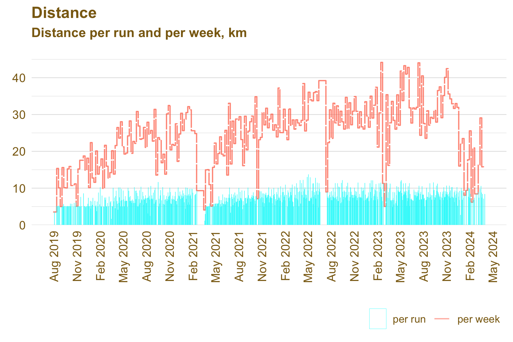
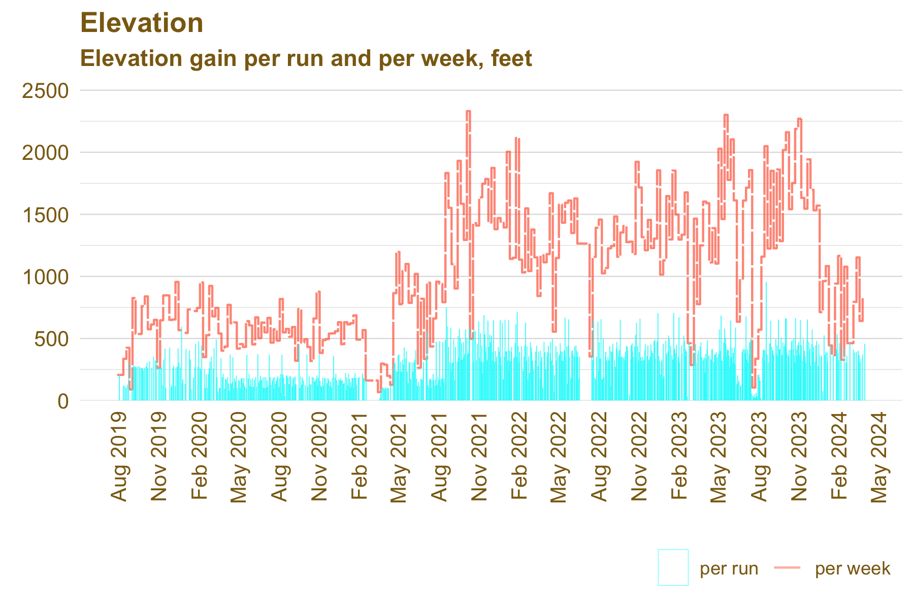
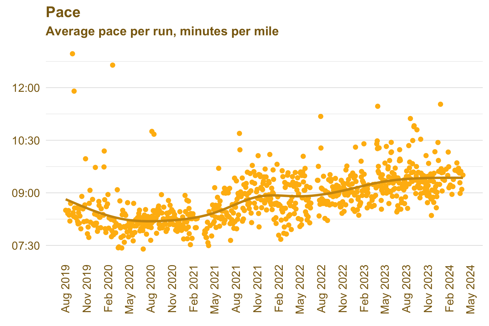
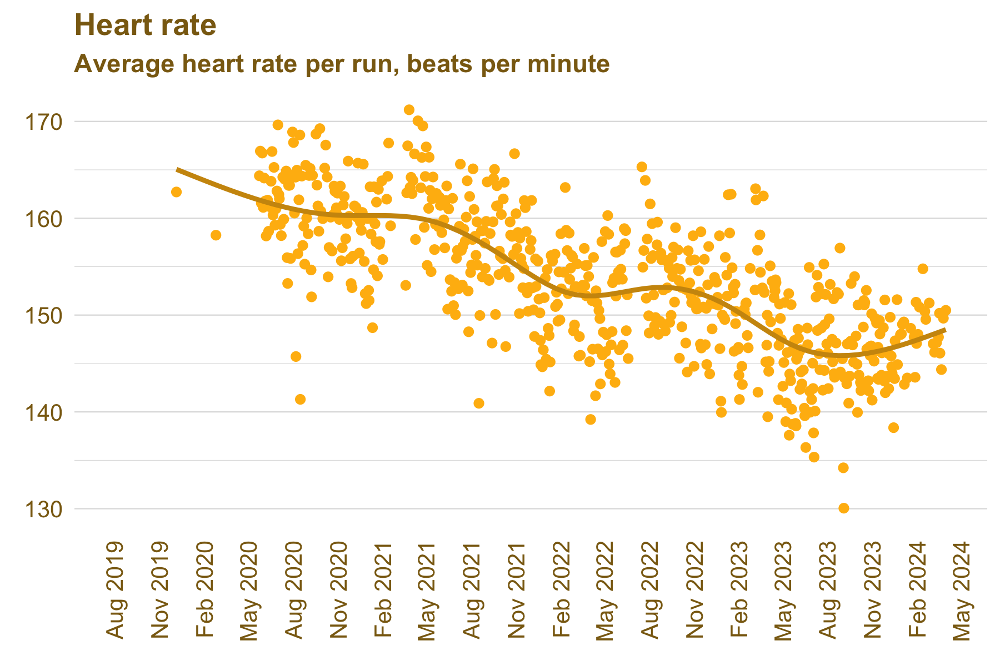

This creates some charts from your Strava runs using R and ggplot. 

It was inspired by [a Reddit post](https://www.reddit.com/r/Strava/comments/yc7qqy/visualising_12_months_of_running_with_strava/) (with better visuals) and [someone else who learned some R by way of their Strava data](https://towardsdatascience.com/using-r-to-analyse-my-strava-data-fc57188b4c51).

If you want to do this on your data you will need to [download an export of your Strava activities](https://support.strava.com/hc/en-us/articles/216918437-Exporting-your-Data-and-Bulk-Export) in CSV format.

Here's what a couple years of my data looks like.

